# Cooking Time - Gamified Recipe Sharing Platform

A modern, full-stack recipe sharing platform with gamification mechanics, built with Django REST Framework, MongoDB, and React + TypeScript.

## 🎯 Overview

**Cooking Time** is a feature-rich recipe platform that transforms cooking into an engaging, social experience. Users can discover recipes, earn XP and badges, follow other cooks, and interact with a vibrant cooking community.

### Key Features

#### 🍳 Recipe Management
- **Browse & Search**: Filter recipes by cuisine, dietary restrictions, difficulty, cooking time, and ingredients
- **Recipe Details**: Comprehensive view with ingredients, instructions, nutritional info, and user reviews
- **Create & Edit**: Rich recipe editor with image upload, ingredient management, and step-by-step instructions
- **Mark as Cooked**: Track your cooking history and earn rewards

#### 🎮 Gamification System
- **XP System**: Earn experience points for cooking, creating recipes, and community engagement
- **Badge System**: Unlock achievements like "First Recipe", "Recipe Master", "Community Champion"
- **Levels**: Progress through cooking levels based on XP earned
- **Action Tracker**: Real-time tracking of user achievements and milestones

#### 👥 Social Features
- **User Profiles**: Customizable profiles with bio, avatar, food preferences, and cooking stats
- **Follow System**: Follow your favorite cooks and build a community
- **Comments**: Share thoughts, tips, and variations on recipes
- **Reviews & Ratings**: Rate recipes and see community feedback

#### 📊 Personalization
- **User Preferences**: Save favorite cuisines, dietary restrictions, and favorite tags
- **Profile Editing**: Update username, email, bio, avatar, and food preferences
- **Cooking Statistics**: View your cooking history, created recipes, and earned badges

## 🏗️ Tech Stack

### Backend
- **Framework**: Django 4.2.7 + Django REST Framework 3.14.0
- **Database**: MongoDB with MongoEngine 0.27.0
- **Authentication**: JWT tokens with custom MongoEngine middleware
- **API**: RESTful API with CORS support

### Frontend
- **Framework**: React 18 + TypeScript 5
- **Build Tool**: Vite 5
- **Styling**: TailwindCSS 3
- **State Management**: Zustand + TanStack Query v5
- **Routing**: React Router v6
- **HTTP Client**: Axios
- **UI Components**: Lucide React icons, React Hot Toast

### Deployment
- **Containerization**: Docker + Docker Compose
- **Backend Server**: Gunicorn
- **Frontend Server**: Nginx (production)

## 📁 Project Structure

```
Recipe_website/
├── backend/                    # Django REST API
│   ├── apps/
│   │   ├── authentication/    # JWT authentication
│   │   ├── gamification/      # XP, badges, levels
│   │   ├── recipes/           # Recipe CRUD, comments, reviews
│   │   └── users/             # User profiles, follow system
│   ├── config/                # Django settings
│   ├── middleware/            # Custom auth middleware
│   ├── manage.py
│   ├── requirements.txt
│   └── Dockerfile
│
├── frontend/                   # React + TypeScript app
│   ├── src/
│   │   ├── components/        # Reusable UI components
│   │   ├── pages/             # Page components
│   │   ├── services/          # API client services
│   │   ├── store/             # Zustand stores
│   │   ├── types/             # TypeScript interfaces
│   │   └── utils/             # Utility functions
│   ├── package.json
│   ├── vite.config.ts
│   └── Dockerfile
│
├── docker-compose.yml         # Multi-container setup
└── README.md
```

## 🚀 Getting Started

### Prerequisites
- **Docker & Docker Compose** (recommended)
- OR **Manual Setup**:
  - Python 3.11+
  - Node.js 18+
  - MongoDB 6.0+

### Option 1: Docker Setup (Recommended)

1. **Clone the repository**
   ```bash
   git clone https://github.com/Najmul-Hasan-Shihab/Cooking_Time.git
   cd Cooking_Time
   ```

2. **Configure environment**
   ```bash
   # Backend .env (backend/.env)
   DJANGO_SECRET_KEY=your-secret-key
   MONGODB_URI=mongodb://mongodb:27017/
   MONGODB_DB=cooking_time_db
   DEBUG=True
   ALLOWED_HOSTS=localhost,127.0.0.1
   CORS_ALLOWED_ORIGINS=http://localhost:5173
   ```

3. **Start services**
   ```bash
   docker-compose up -d
   ```

4. **Access the application**
   - Frontend: http://localhost:5173
   - Backend API: http://localhost:8000/api/
   - MongoDB: localhost:27017

### Option 2: Manual Setup

#### Backend Setup

1. **Create virtual environment**
   ```bash
   cd backend
   python -m venv venv
   source venv/bin/activate  # Windows: venv\Scripts\activate
   ```

2. **Install dependencies**
   ```bash
   pip install -r requirements.txt
   ```

3. **Configure environment**
   Create `backend/.env`:
   ```env
   DJANGO_SECRET_KEY=your-secret-key
   MONGODB_URI=mongodb://localhost:27017/
   MONGODB_DB=cooking_time_db
   DEBUG=True
   ALLOWED_HOSTS=localhost,127.0.0.1
   CORS_ALLOWED_ORIGINS=http://localhost:5173
   ```

4. **Start MongoDB** (if not using Docker)
   ```bash
   mongod --dbpath /path/to/data/db
   ```

5. **Run migrations and start server**
   ```bash
   python manage.py migrate
   python manage.py runserver
   ```

#### Frontend Setup

1. **Install dependencies**
   ```bash
   cd frontend
   npm install
   ```

2. **Configure environment**
   Create `frontend/.env`:
   ```env
   VITE_API_URL=http://localhost:8000
   ```

3. **Start development server**
   ```bash
   npm run dev
   ```

## 📡 API Endpoints

### Authentication
- `POST /api/auth/register/` - Register new user
- `POST /api/auth/login/` - Login (returns JWT tokens)
- `POST /api/auth/logout/` - Logout
- `POST /api/auth/token/refresh/` - Refresh access token

### Users
- `GET /api/users/me/` - Get current user profile
- `PUT /api/users/me/profile/` - Update user profile
- `GET /api/users/{id}/` - Get user by ID
- `GET /api/users/me/stats/` - Get user statistics
- `POST /api/users/{id}/follow/` - Follow/unfollow user

### Recipes
- `GET /api/recipes/` - List all recipes (with filters)
- `POST /api/recipes/` - Create recipe (authenticated)
- `GET /api/recipes/{id}/` - Get recipe details
- `PUT /api/recipes/{id}/` - Update recipe (owner only)
- `DELETE /api/recipes/{id}/` - Delete recipe (owner only)
- `POST /api/recipes/{id}/mark-cooked/` - Mark recipe as cooked
- `POST /api/recipes/{id}/comments/` - Add comment
- `GET /api/recipes/{id}/comments/` - Get comments

### Gamification
- `GET /api/gamification/badges/` - Get all badges
- `GET /api/gamification/my-badges/` - Get current user's badges
- `GET /api/gamification/leaderboard/` - Get XP leaderboard

## 🎨 Environment Variables

### Backend (.env)
```env
# Django
DJANGO_SECRET_KEY=<django-secret-key>
DEBUG=True
ALLOWED_HOSTS=localhost,127.0.0.1

# MongoDB
MONGODB_URI=mongodb://localhost:27017/
MONGODB_DB=cooking_time_db

# CORS
CORS_ALLOWED_ORIGINS=http://localhost:5173
```

### Frontend (.env)
```env
VITE_API_URL=http://localhost:8000
```

## 🧪 Testing

### Backend Tests
```bash
cd backend
python manage.py test
```

### Frontend Tests
```bash
cd frontend
npm run test
```

## 📦 Deployment

### Production Build

#### Frontend
```bash
cd frontend
npm run build
# Output in dist/
```

#### Backend
```bash
cd backend
pip install -r requirements.txt
python manage.py collectstatic --noinput
gunicorn config.wsgi:application --bind 0.0.0.0:8000
```

### Docker Production
```bash
docker-compose -f docker-compose.prod.yml up -d
```

## 📸 Screenshots


| Column 1 | Column 2 |
|---------------|---------------|
| 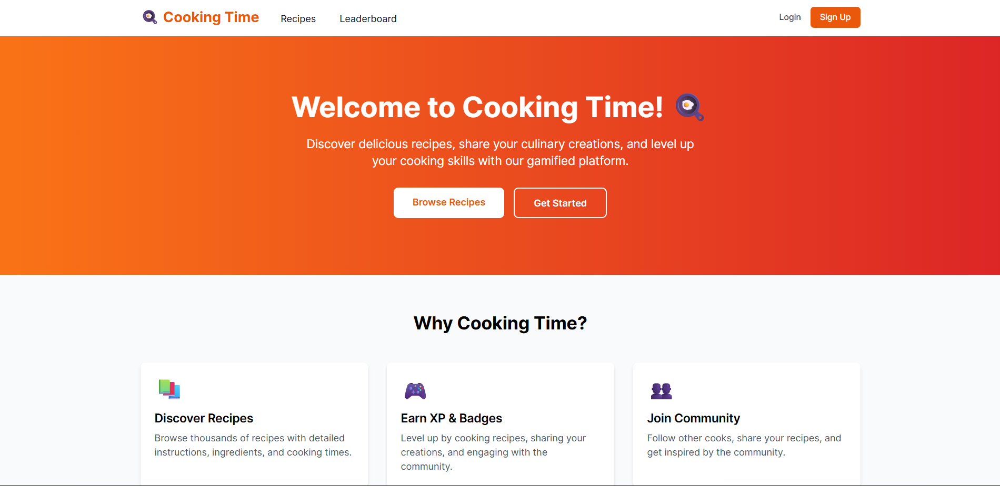 | 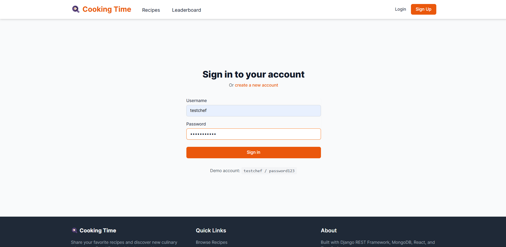 |
| 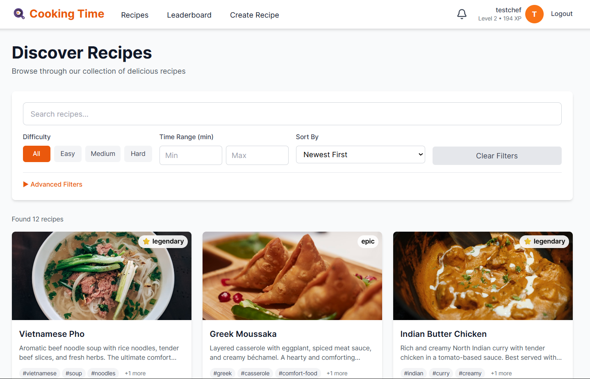 | 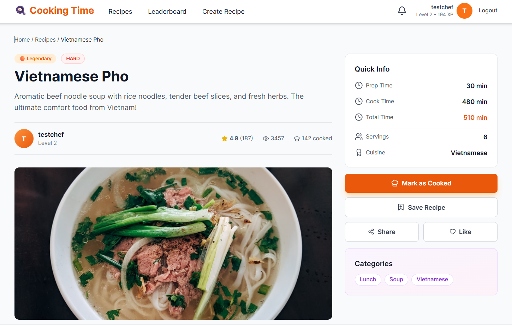 | 
| 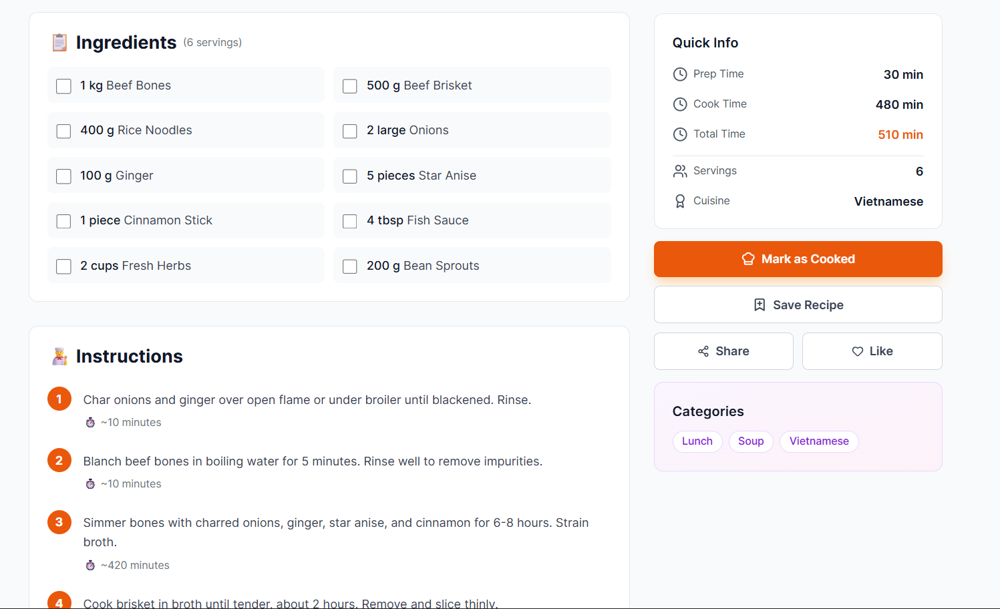 | 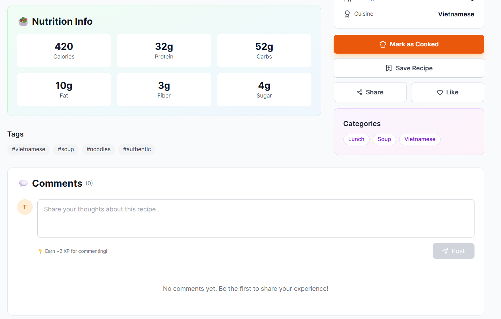 |
| 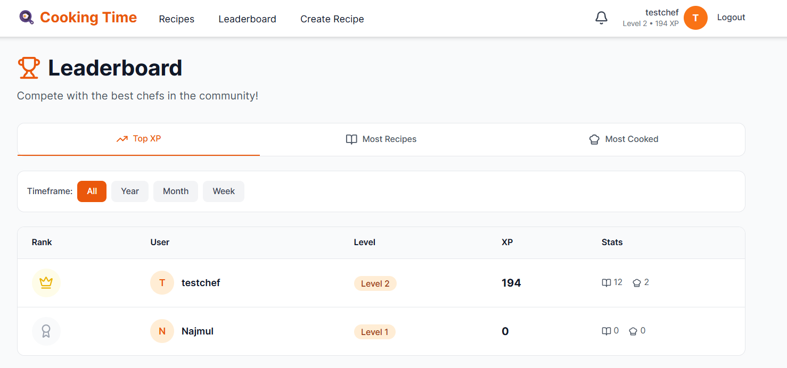 | 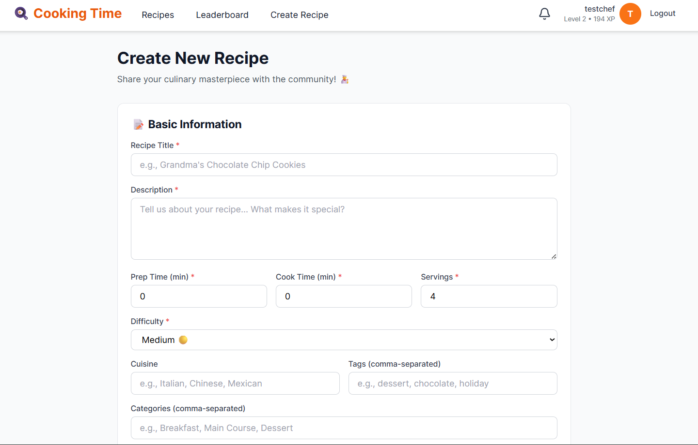 |
| 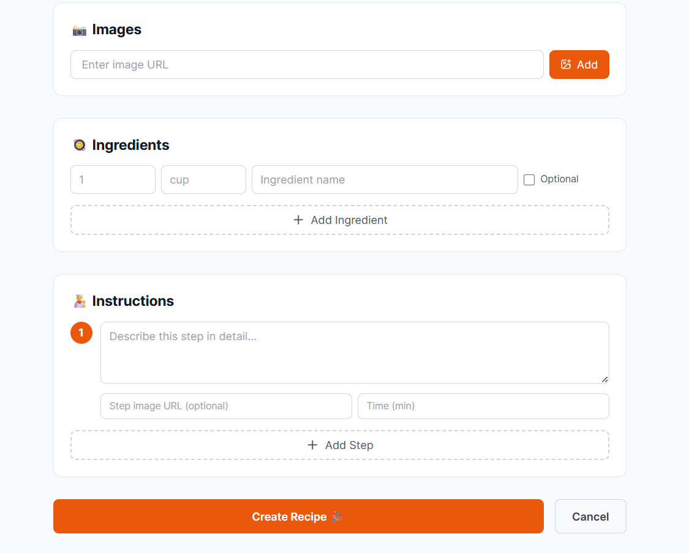 | 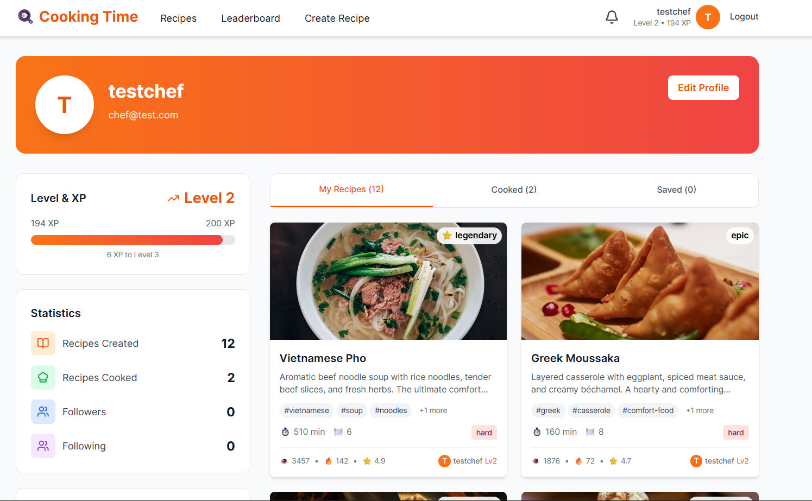 |
| 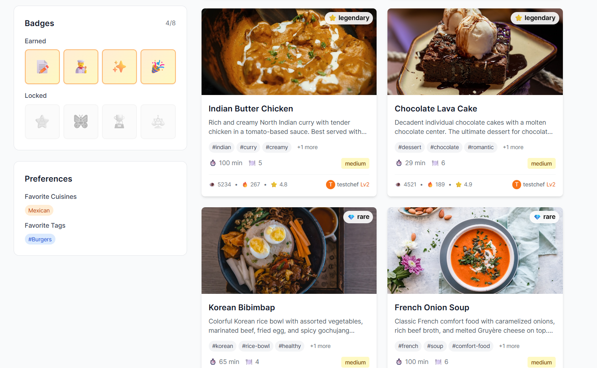 | 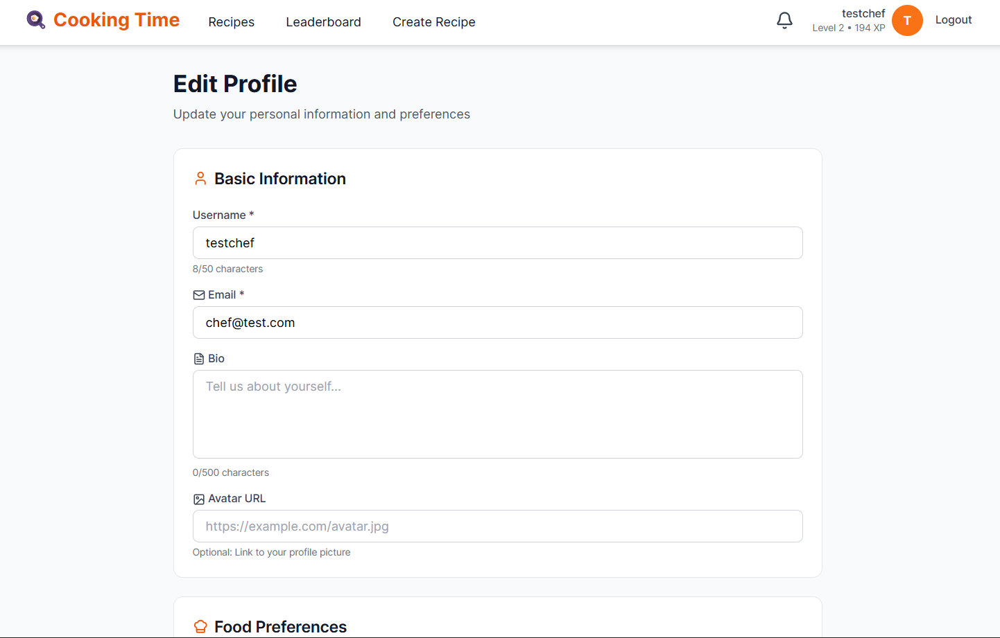 |
| 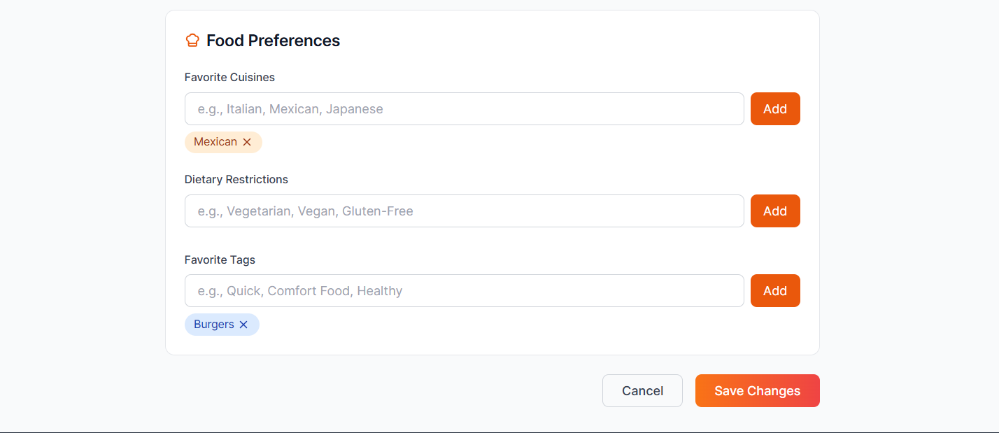 | 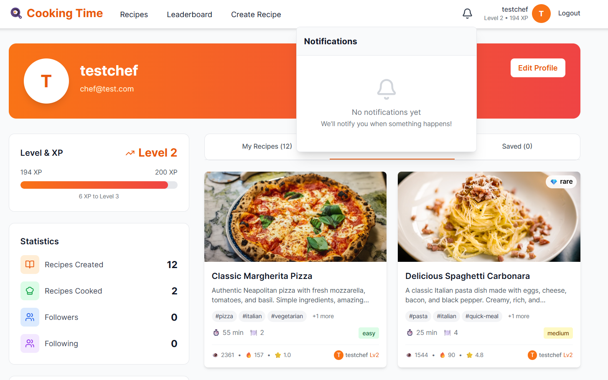 |


## 🤝 Contributing

Contributions are welcome! Please follow these steps:

1. Fork the repository
2. Create a feature branch (`git checkout -b feature/AmazingFeature`)
3. Commit your changes (`git commit -m 'Add some AmazingFeature'`)
4. Push to the branch (`git push origin feature/AmazingFeature`)
5. Open a Pull Request

## 📝 License

This project is licensed under the MIT License.

## 👨‍💻 Author

**Najmul Hasan Shihab**
- GitHub: [@Najmul-Hasan-Shihab](https://github.com/Najmul-Hasan-Shihab)
- Repository: [Cooking_Time](https://github.com/Najmul-Hasan-Shihab/Cooking_Time)

---

Built with ❤️ using Django, React, and MongoDB
